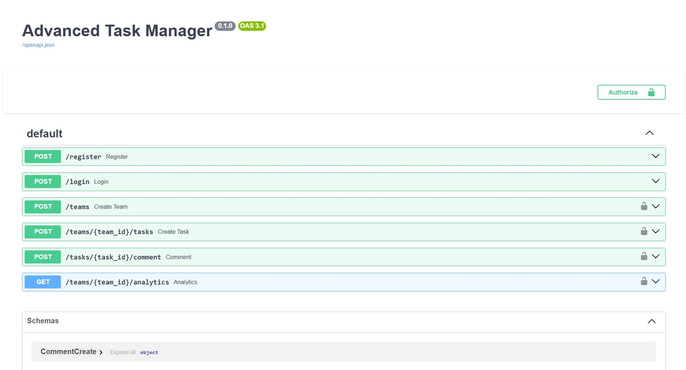
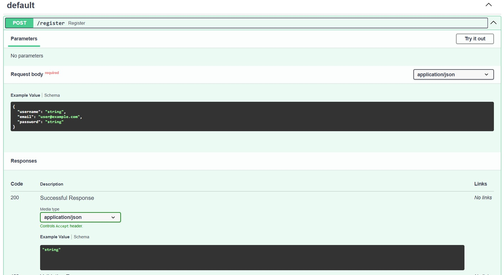
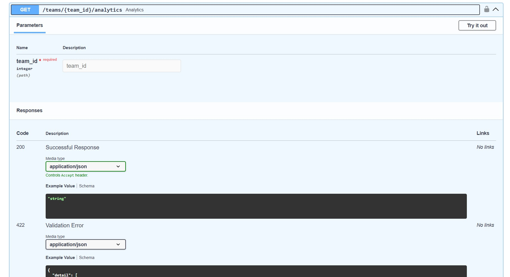
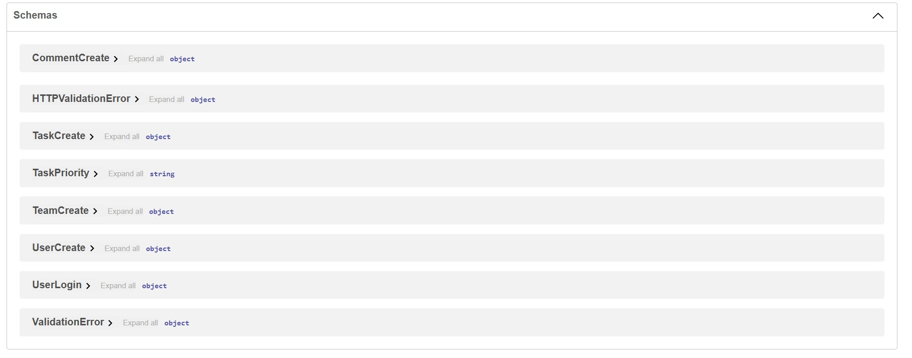

# Task Manager using FastAPI

This project is a fully functional Task Management REST API built with FastAPI, designed to provide a robust backend system for managing personal and team tasks. It features secure user authentication using JWT, ensuring that only authorized users can access and modify data. The system supports role-based permissions for Admins, Managers, and Members, giving each user a defined level of control over tasks and teams. By implementing secure authentication and structured roles, the project demonstrates industry-standard practices for backend security and access management.

The API enables seamless team and task management, allowing users to create teams, assign members, and manage team-specific tasks efficiently. Users can create, update, and delete tasks while setting priorities, deadlines, and labels to keep workflows organized. A commenting system allows team members to collaborate directly on tasks, and all actions are tracked through activity logs, ensuring transparency and accountability. This makes it an ideal project for demonstrating practical team collaboration and task workflow management in a real-world scenario.

Additionally, the project includes a lightweight analytics layer that provides valuable insights into team performance and task progress. Metrics such as completed vs pending tasks, task distribution across team members, and overall productivity can be easily visualized and analyzed. All data is stored using SQLite with SQLAlchemy ORM, and inputs are validated using Pydantic v2, ensuring reliable, consistent, and well-structured data. This makes the system not only functional but also maintainable and scalable for future enhancements.

# Steps to do in the terminal!

Create and activate a virtual environment:

--python -m venv venv
--source venv/Scripts/activate   # On Git Bash / Windows

Install the required dependencies:
--pip install -r requirements.txt

Run the development server:
--uvicorn main:app --reload

Your API will be available at:
http://127.0.0.1:8000

Interactive API documentation:
http://127.0.0.1:8000/docs

# Output

  
  

  
  

